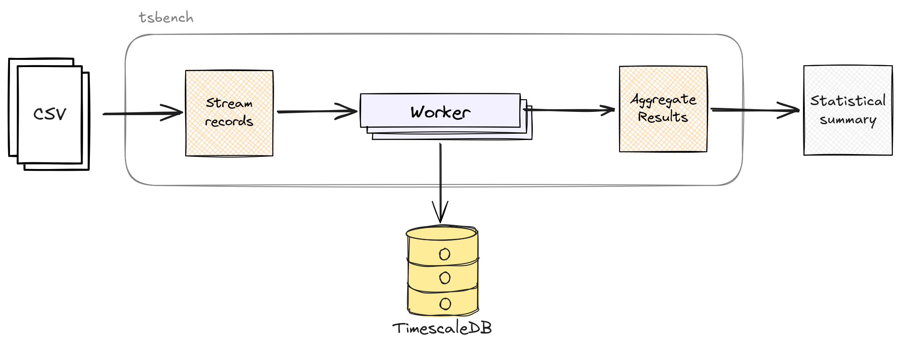

# tsbench - TimescaleDB Query Benchmark CLI 

## Introduction

`tsbench` is a Go cli tool that benchmarks the execution time of parameterised `SELECT` queries against a TimescaleDB instance. It reads query parameters from a CSV file (or standard input), dispatches jobs to configurable number of concurrent workers and emits a statistical summary upon completion. 

This document describes the goals, data‑flow, work‑distribution strategy, and key assumptions behind `tsbench`.

## Goals

* Handle input files of arbitrary size without loading them fully into memory. 
* Execute `SELECT` queries against TimescaleDB concurrently across `n` workers.
* Guarantee that queries for the same hostname are always handled by the same worker. 
* Report the following statistics: 
    * total query count, 
    * number of failed queries, 
    * total processing time, 
    * minimum query time, 
    * median query time, 
    * average query time, 
    * maximum query time. 

## Non goals

* Support for query types other than `SELECT`.
* Support for input formats other than CSV.

## Solution Overview

The high-level data flow is as follows:
1. A single goroutine streams input lines from CSV source and routes query parameters to per-worker channels based on `hostname`. 
2. Each worker consumes parameters from its dedicated channel, measures the TimescaleDB query execution time and forwards the result to a shared results channel.
3. A single aggregator goroutine reads the results channel and updates benchmark statistics. 
4. Once the whole input has been processed a statistical summary is displayed to the caller.  

## Alternatives considered 

**Per-worker result accumulation**: An alternative design would have each worker accumulate its own partial results and merging them only after all CSV lines have been processed. This would eliminate the shared results channel as a potential bottleneck. However, given that the aggregator's workload is orders of magnitude lighter than executing a database query, the bottleneck risk is negligible in practice. Also keeping a single aggregator simplifies the implementation and makes it easier to add [checkpoint](#checkpoint) support.

## Design details 

### Streaming CSV

To avoid loading the whole CSV input into memory, the tool uses a streaming approach: records are read one at a time and forwarded immediately to the appropriate worker channel. The number of inflight requests and the rate of CSV reads are therefore naturally limited by the number of workers, channels capacity and query execution time. 

### Work distribution 

To guarantee that queries for the same hostname are handled by the same worker, the worker for the query is calculated using: 

`workerID = hash(hostname) % numberOfWorkers`

`hash` is a fast, non-cryptographic hash function (e.g. FNV-1a). This deterministic mapping ensures consistent routing without the need for any shared state or coordination between workers. 

> **Worker imbalance**: If `hostname` values are heavily skewed, hash-based routing will send disproportionate work to a small subset of workers. 

### Result aggregation

All required statistics except the median can be computed incrementally as results arrive (count, error count, sum, min, max). Computing an exact median requires storing every query duration which is `O(n)` space. This is acceptable for the expected input sizes. If scale ever demands it, an approximate median via histogram would be an option.  

### Configuration

The tool is controlled by a small set of configuration parameters:
* number of concurrent workers, 
* TimescaleDB connection settings, 
* query timeout, 
* input source (CSV file or standard input)

The exact flag names are left out at this stage.  

### Checkpoint 

Because the tool is designed to handle files of arbitrary size, it is worth considering checkpoint support to avoid losing progress in the event of an unexpected crash. That could be achieved by assigning a `lineNumber` when parsing CSV and sending that along with query parameters to workers. Once the result is submitted, the aggregator keeps track of processed lines and periodically (every configured number of lines) saves that  together with partial results to a local checkpoint file. When tool is restarted there is a way to specify a checkpoint file and load aggregator's saved state from it, then skip all lines that have already been processed.  

## Assumptions

1. **Checkpoint support**: Assumed out of scope for the implementation to keep the design simple. Happy to revisit if required.
2. **Median memory usage**: Assumed that storing all query durations in memory is acceptable. 
3. **CSV error handling**: Assumed the tool should return an error and halt on a malformed CSV record.
4. **Query error handling**: Assumed that a unsuccessful or timed-out query is counted as failed and excluded from main benchmark statistics. 
